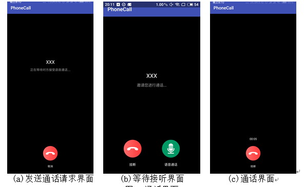
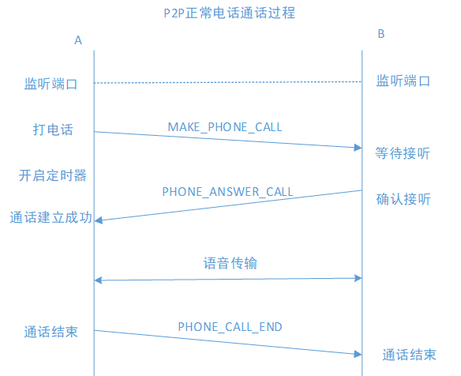
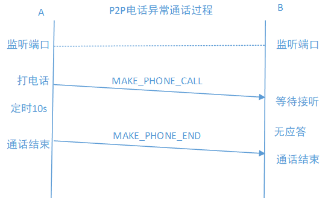

# PhoneCall
#### 一、项目介绍 
基于netty框架实现的局域网内的ip电话，netty是一个socket框架。通过输入对方ip或者点击从服务器上获取到的ip地址进行语音通话，双方通过交换控制信令实现语音通话的控制，共有四个界面的切换，打电话界面，响铃界面，通话界面，主界面。本来打算做个群组通话，但是只做到了两个录音音频合成的操作，还没有实现群组的数据发送，并没有实现群组通话的功能。  

ps：本项目是在[VideoCalling](<https://github.com/xmtggh/VideoCalling>)上进行改进的，该项目是实现局域网的视频传输，我将其语音传输抽取出来进行更改实现语音通话，感谢作者的无私贡献。

#### demo测试 
demo文件夹中的apk文件可以直接下载运行，注册界面可以忽略，随意填写，点击P2P电话按钮进入电话测试。在测试时双方需要同时进入P2P电话界面，因为在线用户需要服务器支持，所以不会显示，测试只需要使用输入对方ip即可。正确输入对方ip即可进行语音通话。

#### 二、项目实现思路
利用安卓里面的AudioRecord录音类进行录音，然后运用speex第三方库进行降噪编码，将编码后的语音流通过socket发送给对方， 对方在收到语音数据时候将进行解码操作，之后使用AudioTrack进行语音的播放。电话逻辑是采用发送文本信息进行控制，本项目中控制和语音流都是同一个端口进行监听略有不足，理论上语音通话和命令传输应该采用两个端口进行控制，类似于ftp协议21端口传输命令，20端口传输文本信息 。  
对于群组通话，比如说有ABC三人进行通话，通过A开启一个聊天室，然后BC加入聊天室，此时BC只需将自己的语音流发送给A，然后在A进行语音的合成操作，将合成的语音在本地播放和发送给BC即可，但是具体的网络连接并没有实现。

#### 界面展示
 
#### 三、项目架构
- audio包：进行音频的录制、编码、解码、播放操作 
- net包：网络连接的包 
  - CallSingal:定义电话信令，如拨打电话操作 
  - Message: 传输数据，包括字节与音流和文字 
  - NettyClient: netty网络连接代理 
  - NettyReceiverHandler: 处理发送数据和接受数据，定义接口回调返回语音信息和电话信令信息
- provider包: 网络连接提供者，通过这个对象可以实现网络数据的发送与接收，需要定义接口进行接受与音数据
- users包：获取服务器上在线用户ip的用户对象
- mixAudioUtils: 混音用的工具类
- MultiVoIPActivity:实现混音界面，需要录制两端音频然后点击混音按钮，之后点击输出混音即可播放
- VoipP2PActivity:ip电话的主要界面，因为需要监听打电话的请求，但是不会写service进行后台监听，所以就在一个activity中写了五个界面进行切换..以后有机会可能会改
- RegisterActivity：注册界面，原本是可以注册然后进行用户登录显示在线，然后直接点击在线用户就可以拨打电话，不过不进行登录也没有关系

#### 四、ip电话控制信令的逻辑图
###### 1.正常通话过程

###### 2.异常通话过程


#### 五、打电话逻辑交互代码
##### 5.1监听端口

对于每一个客户端来说，都需要监听打电话的请求，并且获取到请求方的ip，然后进行数据的交互。首先需要监听端口。这里用到了Netty框架中的`Bootstrap`这个类。主要是用来设置netty的连接属性以及绑定监听的端口，这样，请求通话信息以及后续的音频数据才能够被接收。代码如下：

```
Bootstrap b = new Bootstrap();
 group = new NioEventLoopGroup();
 try {
​     //设置netty的连接属性。
​     b.group(group)
​             .channel(NioDatagramChannel.class) //异步的 UDP 连接
​             .option(ChannelOption.SO_BROADCAST, true)
​             .option(ChannelOption.SO_RCVBUF, 1024 * 1024)//接收区2m缓存
​             .option(ChannelOption.RCVBUF_ALLOCATOR, new FixedRecvByteBufAllocator(65535))//加上这个，里面是最大接收、发送的长度
​             .handler(handler); //设置数据的处理器
​     b.bind(localPort).sync().channel().closeFuture().await();
 } catch (Exception e) {
​     e.printStackTrace();
 } finally {
​     group.shutdownGracefully();
 }
```
##### 5.2 数据传输

主要包括两种数据：

1. 文本信令：建立连接过程中的文本数据
2. 语音数据：通话中的语音数据

每次传输需要判断需要发送的是什么类型的数据，做相应的处理后装入运输载体Message对象中，最后用`ChannelHandlerContext`对象将转换为Json格式的Message对象发送至目标IP地址相应的端口。

```
//发送数据。
public void sendData(String ip, int port, Object data, String type) {
     Message message = null;
     if (data instanceof byte[]) {
         message = new Message();
         message.setFrame((byte[]) data);
         message.setMsgtype(type);
         message.setTimestamp(System.currentTimeMillis());
     }else if (data instanceof String){
         message = new Message();
         message.setMsgBody((String) data);
         message.setMsgtype(type);
         message.setTimestamp(System.currentTimeMillis());
         message.setMsgIp(MLOC.localIpAddress);
     }
     if (channelHandlerContext != null) {
         channelHandlerContext.writeAndFlush(new DatagramPacket(
                 Unpooled.copiedBuffer(JSON.toJSONString(message).getBytes()),
                 new InetSocketAddress(ip, port)));
     }
 }
```

在进行接收数据的时候也是需要进行相同判断操作，然后进行数据的获取。

```
//接收数据。
//服务器推送对方IP和PORT
 ByteBuf buf = (ByteBuf) packet.copy().content(); //字节缓冲区
 byte[] req = new byte[buf.readableBytes()];
 buf.readBytes(req);
 String str = new String(req, "UTF-8");
 Message message = JSON.parseObject(str,Message.class);

Netty框架中有一个类SimpleChannelInboundHandler，主要是对监听的端口传来的数据进行处理的。自定义一个继承自它的类，并重写处理收到数据的方法channelRead0()，将数据写入Message对象。

//发送文字类型信息回调

if (message.getMsgtype().equals(Message.MES_TYPE_NOMAL)){
     if (frameCallback !=null){
         frameCallback.onTextMessage(message.getMsgBody());
         frameCallback.onGetRemoteIP(message.getMsgIp());
     }
 }else if (message.getMsgtype().equals(Message.MES_TYPE_AUDIO)){

//发送语音数据接口回调
     if (frameCallback !=null){
         frameCallback.onAudioData(message.getFrame());
     }
 }
```
##### 5.2 通话信令的控制

在建立连接的过程中，会记录下对方的IP。在通话过程中，将收到的数据传给解码模块进行处理。
总共的控制代码有三种，其中收到打电话信令的时候，需要判断此时被呼叫端是否正忙，如果不忙则跳到响铃界面，否则直接丢包。当收到对方接听电话的指令是，则直接显示说话界面，开始录音并且将接电话标示置为true。当收到通话结束的时候，此时需要判断发出此条结束消息的来源是否是正在通话的客户端，防止在第三方进行呼叫是出现错误挂断的情形。

```
  if (msg.what == phone_make_call) { //收到打电话的请求。

       if (!isBusy){ //如果不忙 则跳转到通话界面。
              showRingView(); //跳转到响铃界面。
              isBusy = true;
           }

  }else if (msg.what == phone_answer_call){ //接听电话
      showTalkingView();
      audioRecorder.startRecording(); //开始语音播放。
      isAnswer = true; //接通电话为真

  }else if (msg.what == phone_call_end){ //收到通话结束的信息
      if (newEndIp.equals(TargetIp)){ //验证发送结束指令的来源
               showBeginView();
               isAnswer = false;
               isBusy = false;
               audioRecorder.stopRecording(); //关闭录音和发送数据
               timer.stop();
            }     

}
```
####  混音实现说明

混音实现主要运用通过录音路录制两段音频，然后将其保存到文件中，混音时以字节流进行读取录音文件，然后采用平均混音算法进行混音，并保存到文件，通过测试可以成功的实现混音操作。主要涉及到安卓文件的创建和以字节流的方式进行文件的读取，混音算法。

混音算法，使用二维byte数组保存两个音频流，然后进行合并。需要传入保存的文件名称

``` 
public static byte[] averageMix(String file1,String file2) throws IOException {

        byte[][] bMulRoadAudioes =  new byte[][]{
                FileUtils.getContent(file1),    //第一个文件
                FileUtils.getContent(file2)     //第二个文件
        };


        byte[] realMixAudio = bMulRoadAudioes[0]; //保存混音之后的数据。
        Log.e("ccc", " bMulRoadAudioes length " + bMulRoadAudioes.length); //2
        //判断两个文件的大小是否相同，如果不同进行补齐操作
        for (int rw = 0; rw < bMulRoadAudioes.length; ++rw) { //length一直都是等于2.依次检测file长度和file2长度
            if (bMulRoadAudioes[rw].length != realMixAudio.length) {
                Log.e("ccc", "column of the road of audio + " + rw + " is diffrent.");
                if (bMulRoadAudioes[rw].length<realMixAudio.length){
                    realMixAudio = subBytes(realMixAudio,0,bMulRoadAudioes[rw].length); //进行数组的扩展
                }
                else if (bMulRoadAudioes[rw].length>realMixAudio.length){
                    bMulRoadAudioes[rw] = subBytes(bMulRoadAudioes[rw],0,realMixAudio.length);
                }
            }
        }

        int row = bMulRoadAudioes.length;       //行
        int column = realMixAudio.length / 2;   //列
        short[][] sMulRoadAudioes = new short[row][column];
        for (int r = 0; r < row; ++r) {         //前半部分
            for (int c = 0; c < column; ++c) {
                sMulRoadAudioes[r][c] = (short) ((bMulRoadAudioes[r][c * 2] & 0xff) | (bMulRoadAudioes[r][c * 2 + 1] & 0xff) << 8);
            }
        }
        short[] sMixAudio = new short[column];
        int mixVal;
        int sr = 0;
        for (int sc = 0; sc < column; ++sc) {
            mixVal = 0;
            sr = 0;
            for (; sr < row; ++sr) {
                mixVal += sMulRoadAudioes[sr][sc];
            }
            sMixAudio[sc] = (short) (mixVal / row);
        }

        //合成混音保存在realMixAudio
        for (sr = 0; sr < column; ++sr) { //后半部分
            realMixAudio[sr * 2] = (byte) (sMixAudio[sr] & 0x00FF);
            realMixAudio[sr * 2 + 1] = (byte) ((sMixAudio[sr] & 0xFF00) >> 8);
        }

        //保存混合之后的pcm
        FileOutputStream fos = null;
        //保存合成之后的文件。
        File saveFile = new File(FileUtils.getFileBasePath()+ "averageMix.pcm" );
        if (saveFile.exists()) {
            saveFile.delete();
        }
        fos = new FileOutputStream(saveFile);// 建立一个可存取字节的文件
        fos.write(realMixAudio);
        fos.close();// 关闭写入流
        return realMixAudio; //返回合成的混音。
    }

    //合并两个音轨。
    private static byte[] subBytes(byte[] src, int begin, int count) {
        byte[] bs = new byte[count];
        System.arraycopy(src, begin, bs, 0, count);
        return bs;
    }
```

传入文件名称，返回文件内容的字节流
```
    //将文件流读取到数组中，
    public static byte[] getContent(String filePath) throws IOException {
        File file = new File(filePath);
        long fileSize = file.length();
        if (fileSize > Integer.MAX_VALUE) {
            Log.d("ccc","file too big...");
            return null;
        }
        FileInputStream fi = new FileInputStream(file);
        byte[] buffer = new byte[(int) fileSize];
        int offset = 0;
        int numRead = 0;
        //while循环会使得read一直进行读取，fi.read()在读取完数据以后会返回-1
        while (offset < buffer.length
                && (numRead = fi.read(buffer, offset, buffer.length - offset)) >= 0) {
            offset += numRead;
        }
        //确保所有数据均被读取
        if (offset != buffer.length) {
            throw new IOException("Could not completely read file "
                    + file.getName());
        }
        fi.close();
        return buffer;
    }
```
万水千山总是情，点个star行不行~  

